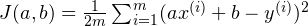
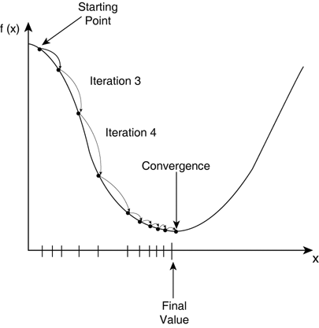
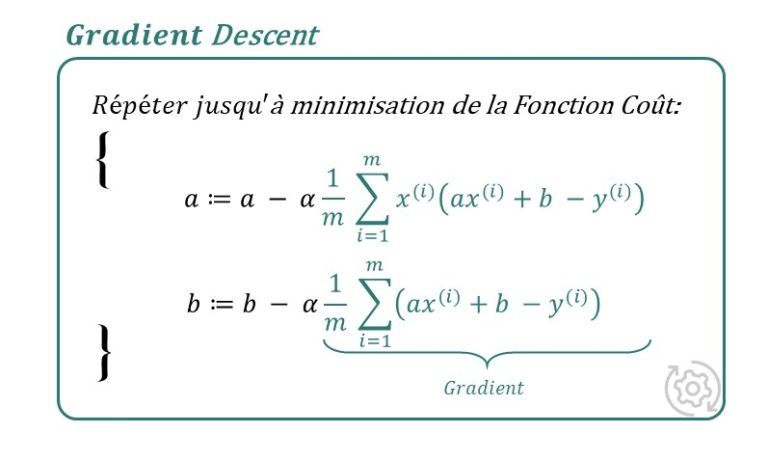
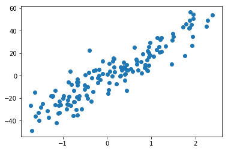
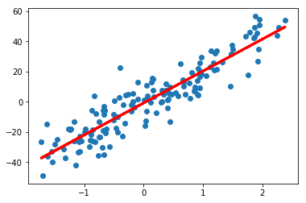
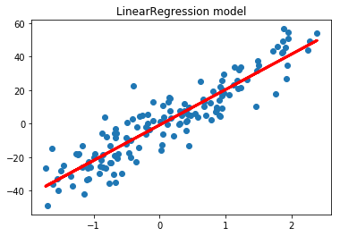

# Model-regression-linear-from-scratch
Implement model regression linear simple and multiple form scratch and compare it the sklearn model


# Contexts

    L'idee de ce projet est d'aide les gens qui veulent en savoir plus sur les maths (et les algorithms) qui se cachent derriere la regression linear.
    Permettre de comprendre un peu plus en profondeur la therorie derriere le machie learning.
    Dans ce jupyter nous allons commencer avec la Regression Linear, un algorithme beaucoup plus simple.

# Explications

    La regression linear est etablie par une equation : y = a*X + b


    L'objectif du model sera de trouver les bons parameters pour : a , b


    
    On a donc besoin d'une fonction de cout (ou fonction erreur) Pour nous permettre d'evaluer le model et par la suite apprendre sur les parameters. Cette fonction est definie par : 
    



    Explication : supposons que notre model predit une valeur de y=600 alors qu'il devrait predire 550 ?
    On dit alors que notre model a fait une erreur de -50 (550-600) on peut donc parfois obtenir des erreurs negatives, pour palier a ce probleme... on a deux solutions :
        Soit on prend la valeurs absolue de l'erreur : |550-600|=50 (Celui est la procedure avec mean absolute error)
        Soit on prend la racine carree du resultat soit (-50)**2 = 2500 (on a donc une erreur trop grande il faut donc le penaliser) mais avant on applique cela a tout notre dataset ainsi on la somme precedente.

    la representation de cette fonction est convexe (une fonction qui a un seul minima possible)



    Cette fonction est donc un algorithm iterative, il faut applique des derives partielles et multiplier par une certain valeur (c'est ce qu'on appelle taux d'apprentissage ou encore learning rate). 


    Il faut donc trouver les gradients pour chaque parameters : a,b



    A savoir : Tout ce qu'on fait en realite, c'est de derive la fonction et calculer le nouveau parameter en retranchant a chaque fois l'encienne valeur et comme la decente de gratient a un seul mina possible (une fonction convexe)... apres plus iteration on va donc tomber sur le minima (ou en tout etre proche).
    Mais attention, vous remarquez qu'on multiplie par le learning rate apres avoir calucle la somme des erreurs, cette valeur est importante... il faut savoir la choisir, en generale cette valeur est tres faible et varie entre 0.001 a 0.1.
    Si cette valeur est trop grande on risque de ne pas tomber sur le minima... on ferra des sauts sans jamais tomber decus, par contre si cette valeur est tres petite on risque de mettre bcp de temps avant d'y arriver on aura donc besoin de beaucoup d'iteration.
    
    

    Si vous avez encore des doutes ou que vous n'avez pas tout compris : Je vous recomande de suivre cette 
    video youtube qui l'explique bien avant de continuer sur le code : 
   [Gradient decente Thibault Neveu](https://www.youtube.com/watch?v=JGgT7L7wKQM)
   ou encore sur wiki [https://fr.wikipedia.org/wiki/Algorithme_du_gradient](https://fr.wikipedia.org/wiki/Algorithme_du_gradient) 
   / Guillaume (Machine Learnia)

# Import tools


```python
import numpy as np
import matplotlib.pyplot as plt
from sklearn.datasets import make_regression
import pandas as pd
import seaborn as sns
```

## Create data


```python
np.random.seed(0)
x, y = make_regression(n_samples=180, n_features=1, noise=10)
```


```python
from sklearn.model_selection import train_test_split
x_train, x_test, y_train, y_test = train_test_split(x, y, test_size=0.2)
```


```python
x_train.shape
```


    (144, 1)


```python
x_test.shape
```


    (36, 1)


```python
print(y_train.shape, y_test.shape)
```

    (144,) (36,)


```python
plt.scatter(x_train, y_train)
```


    <matplotlib.collections.PathCollection at 0x7f212439ab70>





## Create model


```python
class RegressionLinearCustom():
    """
        Implementation Linear Regression Model with gradient decente solution.
        The gradient decente use partial derivate.
        This model have two essentiel parameters :
            - Learning rate : learning_rate (0.01 default)
            - max interation : max_iter (1000 default)
        The other parameters:
            - coefs_ this is coeffients of parameters data
            - intercept_ this is intercept of function, can edit it True or False
            - error_gradient this is gradient parameters learning.
    """
    
    def __init__(self, learning_rate=0.01, max_iter=1000):
        """
            Initializer parameters model
        """
        self.lrate=learning_rate
        self.max_iter=max_iter
        self.coefs_=None
        self.intercept_= 0
        self.error_gradient = None
        self.is_fited = False
        
    def error_coefs(self, coefs,intercept_, xi, yi, m, lr):
        """
            Calcul coefs gradient:
            -- Parameters :
                - xi : value for one sample in data
                - yi : real value prediction for this precedent sample
                - m : dataset size
                - lr : learning rate
        """
        return lr/m * (xi*(coefs*xi+intercept_-yi))
    
    def error_intercept(self,coefs, intercept_, xi, yi, m, lr):
        """
            Calcul intercept gradient
            -- Parameters:
                - xi : value for one sample in data
                - yi : real value prediction for this precedent sample
                - m : dataset size
                - lr : learning rate
        """
        return lr/m * sum(coefs*xi+intercept_-yi)
    
    def cout_function(self, m, coefs, intercept_, xi, yi):
        """
            Gradient function
            -- Parameters:
                - xi : value for one sample in data
                - yi : real value prediction for this precedent sample
                - m : dataset size
        """
        return sum((yi - coefs*xi+intercept_)**2)/2*m
    
    def score(self, x, y):
        """
            Score function
        """
        return 1 - sum((y-self.predict(x))**2)/sum((y-y.mean())**2)
        
    
    def fit(self,x, y):
        """
            Fit fuction, learning parameters
            -- Parameters:
                - x, sample data
                - y, predict data
        """
        
        if x.shape[0] != y.shape[0]:
            return ValueError("x and y must have same sample")
        
        m = x.shape[0] # size du dataset
        self.coefs_ = np.zeros(x.shape[1]) # nuers of features
        error_intermed = None
        for _ in range(self.max_iter):
            for xi,yi in zip(x,y):
                self.coefs_ -= self.error_coefs(self.coefs_,self.intercept_, xi, yi, m, self.lrate) 
                self.intercept_ -= self.error_intercept(self.coefs_, self.intercept_, xi, yi,m, self.lrate) 
                self.error_gradient = self.cout_function(m, self.coefs_, self.intercept_, xi, yi)
         
        self.is_fited = True
        print('RegressionLinear(learning_rate={}, max_iter={})'.format(self.lrate, self.max_iter))
    
    def predict(self, x):
        """
            Predict function : 
            -- Parameters:
                - x, sample data what to predict
        """
        if not self.is_fited:
            return ValueError("model must fited after predict")
        if x.shape[1] != self.coefs_.shape[0]:
            return ValueError("the features of x do not have the same size as those to train")
        return (x*self.coefs_).sum(axis=1)+self.intercept_ # equation -- coefs*X + intercept
```


```python
lr = RegressionLinearCustom()
```


```python
lr.fit(x_train,y_train)
```

    RegressionLinear(learning_rate=0.01, max_iter=1000)


```python
lr.coefs_
```


    array([21.1303301])


```python
lr.intercept_
```


    -0.8352580818314677


```python
plt.scatter(x_train, y_train)
plt.plot(x_train, lr.predict(x_train), c='red', lw=3)
```


    [<matplotlib.lines.Line2D at 0x7f212433dc50>]





     Evalute custum model


```python
from sklearn.metrics import mean_squared_error, mean_absolute_error, median_absolute_error
print('MAE : ', mean_absolute_error(y_test, lr.predict(x_test)))
print('RMSE : ', np.sqrt(mean_squared_error(y_test, lr.predict(x_test))))
print('Median absolute error : ', median_absolute_error(y_test, lr.predict(x_test)))
```

    MAE :  7.877842240242018
    RMSE :  10.042785587416502
    Median absolute error :  6.54594841083626


```python
print('Score Custum model : ', lr.score(x_test, y_test))
```

    Score Custum model :  0.7612679859914026


## Comparaison avec Sklearn


```python
from sklearn.linear_model import LinearRegression
```


```python
lr2 = LinearRegression()
```


```python
lr2.fit(x_train,y_train)
```


    LinearRegression(copy_X=True, fit_intercept=True, n_jobs=None, normalize=False)


```python
lr2.coef_
```


    array([21.12867091])


```python
lr2.intercept_
```


    -0.8328942101095778


```python
plt.scatter(x_train,y_train)
plt.plot(x_train, lr2.predict(x_train), c='red', lw=3)
plt.title('LinearRegression model')
```


    Text(0.5,1,'LinearRegression model')





    Evaluate Linear regression sklearn


```python
print('MAE : ', mean_absolute_error(y_test, lr2.predict(x_test)))
print('RMSE : ', np.sqrt(mean_squared_error(y_test, lr2.predict(x_test))))
print('Median absolute error : ', median_absolute_error(y_test, lr2.predict(x_test)))
```

    MAE :  7.878092566619603
    RMSE :  10.043458219943728
    Median absolute error :  6.544939758863786


```python
print('Score sklearn model : ', lr2.score(x_test, y_test))
```

    Score sklearn model :  0.7612360059607552


## Multiple Linear regression


```python
np.random.seed(0)
x1, y1 = make_regression(n_samples=1280, n_features=3, noise=10)
```


```python
x1_train, x1_test, y1_train, y1_test = train_test_split(x1, y1, test_size=0.2)
```


```python
x1_train.shape
```


    (1024, 3)


```python
y1_train.shape
```


    (1024,)


```python
lr3 = RegressionLinearCustom(learning_rate=0.01)
```


```python
lr3.fit(x1_train, y1_train)
```

    RegressionLinear(learning_rate=0.01, max_iter=1000)


```python
lr3.coefs_
```


    array([64.59675767, 62.55187783, 60.5581771 ])


```python
lr3.intercept_
```


    -3.8782243776243024


    - Evaluate LinearRegressionCustum for multiple Regression


```python
print('MAE : ', mean_absolute_error(y1_test, lr3.predict(x1_test)))
print('RMSE : ', np.sqrt(mean_squared_error(y1_test, lr3.predict(x1_test))))
print('Median absolute error : ', median_absolute_error(y1_test, lr3.predict(x1_test)))
```

    MAE :  9.187022392401918
    RMSE :  11.324822688558232
    Median absolute error :  7.700921217861264


```python
print('Score Custum model multiple regression : ', lr3.score(x1_test, y1_test))
```

    Score Custum model multiple regression :  0.9901428799842829


## Sklearn


```python
from sklearn.linear_model import SGDRegressor
sg = SGDRegressor()
```


```python
lrr3 = LinearRegression()
```


```python
lrr3.fit(x1_train, y1_train)
```


    LinearRegression(copy_X=True, fit_intercept=True, n_jobs=None, normalize=False)


```python
sg.fit(x1_train, y1_train)
```


    SGDRegressor(alpha=0.0001, average=False, early_stopping=False, epsilon=0.1,
                 eta0=0.01, fit_intercept=True, l1_ratio=0.15,
                 learning_rate='invscaling', loss='squared_loss', max_iter=1000,
                 n_iter_no_change=5, penalty='l2', power_t=0.25, random_state=None,
                 shuffle=True, tol=0.001, validation_fraction=0.1, verbose=0,
                 warm_start=False)


```python
lrr3.coef_
```


    array([66.6285208 , 64.15098078, 63.81493204])


```python
sg.coef_
```


    array([66.60881996, 64.15799953, 63.74762287])


```python
lrr3.intercept_
```


    0.4128450631445766


```python
sg.intercept_
```


    array([0.44550697])


    - Evaluate LinearRegression


```python
print('MAE : ', mean_absolute_error(y1_test, lrr3.predict(x1_test)))
print('RMSE : ', np.sqrt(mean_squared_error(y1_test, lrr3.predict(x1_test))))
print('Median absolute error : ', median_absolute_error(y1_test, lrr3.predict(x1_test)))
```

    MAE :  7.9704692752093855
    RMSE :  9.851604662213807
    Median absolute error :  6.889328330159444


```python
print('Score sklearn model LinearRegression : ', lrr3.score(x1_test, y1_test))
```

    Score sklearn model LinearRegression :  0.9925406467656483


    - Evaluate SGDRegressor


```python
print('MAE : ', mean_absolute_error(y1_test, sg.predict(x1_test)))
print('RMSE : ', np.sqrt(mean_squared_error(y1_test, sg.predict(x1_test))))
print('Median absolute error : ', median_absolute_error(y1_test, sg.predict(x1_test)))
```

    MAE :  7.972534909526331
    RMSE :  9.855358962547134
    Median absolute error :  6.859896458867109


```python
print('Score sklearn SGDRegressor : ', sg.score(x1_test, y1_test))
```

    Score sklearn SGDRegressor :  0.992534960384724


# Piste d'amelioration

    - Ameliorer ce model pour prendre en compte la regression non-linear.
    - Jouer sur le learning rate ou le max_inter lorsque le model under-fit.
    - Ajouter un peu plus de performance sur modele, notament permettre de normalizer les donnees avant de faire le fit.

#Credit : 
[Harouna Diallo](https://harouna.crd.co/)
